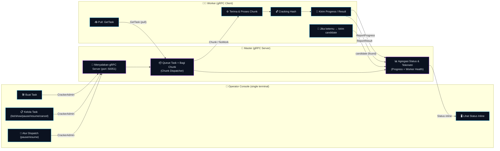

<!--
  Cerberus README
  Repo : https://github.com/h0w1tzxr/Cerberus
  Lisensi: GNU GPLv3
-->

<div align="center">

<!-- Animated header -->
<a href="https://github.com/h0w1tzxr/Cerberus">
  
</a>

<br/>

<!-- Badges -->
<p>
  <a href="https://github.com/h0w1tzxr/Cerberus/blob/main/LICENSE">
    
  </a>
  
  
  
  <a href="https://github.com/h0w1tzxr/Cerberus/issues">
    
  </a>
  <a href="https://github.com/h0w1tzxr/Cerberus/stargazers">
    
  </a>
  <a href="https://github.com/h0w1tzxr/Cerberus/network/members">
    
  </a>
  <a href="https://github.com/h0w1tzxr/Cerberus/commits/main">
    
  </a>
</p>

<!-- Decorative divider -->


</div>

> **Cerberus** adalah demo hash cracking terdistribusi berbasis **gRPC** dengan arsitektur **Master–Worker**.
> Alur kerja berfokus pada kontrol operator yang jelas: membuat task, memantau progres, dan mengatur dispatch secara manual, sementara worker terus menarik pekerjaan.
>
> README ini ditulis dengan gaya **CLI-first** yang ramah pengguna dan menampilkan **status inline** (tanpa TUI layar penuh).

---

## ✨ TL;DR

- ✅ **Workflow manual** yang jelas dengan lifecycle task yang tegas.
- ✅ **Inline status rendering**: status “menempel” di bawah terminal, log tetap scroll.
- ✅ Output Rich CLI dengan **tag ANSI semantic**.
- ✅ Mode hash: **MD5** dan **SHA256**.
- ✅ **Wordlist streaming + indexing** untuk file besar.
- ✅ Monitoring **Worker Health** dan **Rate per Worker**.

## 🧩 Fitur Utama (Card View)

<table>
  <tr>
    <td width="33%" valign="top">
      <h3>🧭 Operator-Controlled</h3>
      <ul>
        <li>Task lifecycle jelas</li>
        <li>Dispatch bisa pause/resume</li>
        <li>Audit lewat output CLI</li>
      </ul>
    </td>
    <td width="33%" valign="top">
      <h3>⚡ Inline Status UI</h3>
      <ul>
        <li>Log tetap scroll normal</li>
        <li>Status bar update ~30 Hz</li>
        <li>Tanpa full-screen TUI</li>
      </ul>
    </td>
    <td width="33%" valign="top">
      <h3>🧱 Skalabel & Terukur</h3>
      <ul>
        <li>Worker menarik pekerjaan (pull)</li>
        <li>Telemetri per-chunk</li>
        <li>Ringkasan per-worker</li>
      </ul>
    </td>
  </tr>
</table>

## 🧰 Prasyarat

- **Go 1.22+**
- Port **`50051`** dapat diakses antara **Master** dan **Worker**
- Jika memakai wordlist, **path harus ada di Master dan Worker**

## 🔐 Security Defaults

Mulai versi ini, koneksi gRPC memakai **TLS** dan butuh **token autentikasi**.
Saat Master pertama kali dijalankan, ia akan membuat sertifikat self-signed dan token admin/worker
di config directory pengguna.

Lokasi config directory (default):
- Windows: `%APPDATA%\cerberus`
- macOS: `~/Library/Application Support/cerberus`
- Linux: `~/.config/cerberus`

File yang dibuat:
- `server.crt`
- `server.key`
- `tokens`

Jika Worker berjalan di mesin lain, salin `server.crt` dan `tokens` ke mesin Worker
atau set environment variable berikut:
- `CERBERUS_TLS_CA=/path/to/server.crt`
- `CERBERUS_WORKER_TOKEN=<token>`

Untuk CLI admin:
- `CERBERUS_TLS_CA=/path/to/server.crt`
- `CERBERUS_ADMIN_TOKEN=<token>`

Opsional override:
- `CERBERUS_TLS_CERT` / `CERBERUS_TLS_KEY` (server)
- `CERBERUS_TLS_SERVER_NAME` (client)

## 🗂️ Struktur Project

```text
Master/           # gRPC server + admin CLI
Worker/           # gRPC client (worker)
Common/wordlist/  # wordlist streaming + indexing
Common/console/   # renderer inline + tag ANSI
cracker/          # protobuf + generated stubs
```

---

## 🚀 Quickstart

### 1) Install dependency

```bash
go mod tidy
```

### 2) Jalankan Master di Terminal 1

```bash
go run ./Master
```

Output contoh:

```text
[i] Master Hash Cracker running on port :50051
[i] Ready for Workers...
```

### 3) Konfigurasi Worker dulu

Set alamat Master + token Worker lewat environment variable:

```bash
export CERBERUS_MASTER_ADDR="<IP_MASTER>:50051"
export CERBERUS_TLS_CA="/path/to/server.crt"
export CERBERUS_WORKER_TOKEN="<token>"
```

Atau lewat flag:

```bash
go run ./Worker --addr "<IP_MASTER>:50051" --tls-ca "/path/to/server.crt" --token "<token>"
```

### 4) Jalankan Worker di device yang akan jadi Worker

```bash
go run ./Worker
```

### 5) Tambah task lewat prompt `cerberus>`

```bash
task add --hash <hash> --mode md5 --keyspace 100000 --chunk 1000
```

<details>
<summary><b>✅ Tips</b> (klik untuk buka)</summary>

* Mulailah dengan `--keyspace` kecil dulu untuk validasi end-to-end.
* Kamu juga bisa menjalankan CLI dari terminal lain: `go run ./Master task add ...`

</details>

---

## 🖥️ Inline Status Rendering (Tanpa TUI)

Cerberus memakai CLI linear yang nyaman untuk terminal:

* Log tetap scroll normal.
* Satu baris status menempel di bawah terminal

### 🎨 Tag ANSI

| Jenis   |          Tag         |
| ------- | -------------------- |
| Sukses  |          [+]         |
| Error   |          [!]         |
| Warning |          [*]         |
| Info    |          [i]         |

---

## 🧪 CLI Usage

Binary **Master** akan menjadi CLI saat diberi argumen.
Jika dijalankan tanpa argumen, Master menyalakan server + console operator di prompt `cerberus>`.
Jika memakai alamat default lokal dan server belum berjalan, Master akan **auto-start**.

### Bantuan global

```bash
go run ./Master -h
```

### Global flags

* `--addr` (default `localhost:50051`) - alamat gRPC Master
* `--operator` (default `$USER` atau `operator`) - identitas operator
* `--token` - admin auth token
* `--tls-ca` - path ke TLS CA certificate
* `--tls-server-name` - override TLS server name

### Commands

* `task` - manajemen task
* `worker` - daftar worker
* `dispatch` - pause/resume dispatch global

### Shortcut single-dash

* `-t` = `task`
* `-w` = `worker`
* `-d` = `dispatch`

### Shortcut subcommand task

* `-a` add
* `-b` add-batch
* `-l` list
* `-s` show
* `-d` dispatch
* `-c` cancel
* `-p` pause
* `-u` resume
* `-r` retry

### Bantuan kontekstual

```bash
go run ./Master task -h
go run ./Master task add -h
go run ./Master task list -h
```

### 💾 Output file (-o)

* Gunakan `-o` / `--output` pada `task add` atau `task add-batch`.
* Output disusun **satu baris per hash** sesuai urutan input batch.
* Isi baris adalah **password hasil crack**, atau kosong jika tidak ditemukan.
* File output ditulis dengan permission terbatas (owner-only).

---

## 🔁 Lifecycle Task

Task baru otomatis **`approved`** dan **`dispatch_ready`** sehingga worker langsung bisa mengambil.

### Status

* `queued`
* `reviewed`
* `approved`
* `running`
* `completed`
* `failed`
* `canceled`

### Action

* `review`: `queued -> reviewed`
* `approve`: `reviewed -> approved`
* `dispatch`: set task dispatch-ready
* `pause`: stop assign chunk baru
* `resume`: izinkan dispatch lagi
* `cancel`: stop task, clear leases
* `retry`: reset task gagal ke `approved`
* `set-priority`: ubah prioritas queue

---

## 🧾 Contoh CLI

<details>
<summary><b>➕ Add task</b></summary>

```bash
go run ./Master task add \
  --hash <hash> \
  --mode md5 \
  --keyspace 100000 \
  --chunk 1000 \
  -o cracked.txt \
  --priority 5 \
  --max-retries 3
```

</details>

<details>
<summary><b>📚 Add dengan wordlist</b></summary>

```bash
go run ./Master task add \
  --hash <hash> \
  --mode sha256 \
  --wordlist /path/to/wordlist.txt \
  --chunk 1000
```

</details>

<details>
<summary><b>📦 Add batch</b></summary>

```bash
go run ./Master task add-batch --file hashes.txt --mode md5 --keyspace 100000 --chunk 1000 -o cracked.txt
```

</details>

<details>
<summary><b>📋 List task</b></summary>

```bash
go run ./Master task list
```

</details>

<details>
<summary><b>🔎 Filter status</b></summary>

```bash
go run ./Master task list --status queued,reviewed,approved,running,failed
```

</details>

<details>
<summary><b>🧠 Detail task</b></summary>

```bash
go run ./Master task show task-1
```

</details>

<details>
<summary><b>⏸️ Pause / ▶️ Resume task</b></summary>

```bash
go run ./Master task pause task-1 task-2
go run ./Master task resume task-1
```

</details>

<details>
<summary><b>🧨 Cancel task</b></summary>

```bash
go run ./Master task cancel --reason "operator abort" task-1
```

</details>

<details>
<summary><b>🌐 Pause / Resume dispatch global</b></summary>

```bash
go run ./Master dispatch pause
go run ./Master dispatch resume
```

</details>

<details>
<summary><b>🧑‍🏭 List worker</b></summary>

```bash
go run ./Master worker list
```

</details>

---

## 📡 Telemetri & Reporting

Worker mengirim telemetri per chunk saat selesai:

* `processed` dan `total`
* `duration_ms`
* `avg_rate`

Master mengagregasi dan menampilkan:

* Status worker + chunk aktif di inline status
* Leaderboard akhir: jumlah task per worker, rata-rata durasi task (ms), durasi task terakhir (ms), total durasi task (ms)
* Health/stale worker tetap terlihat di status, bukan di leaderboard

---

## 🧠 Arsitektur

### Komponen

* **CrackerService** (gRPC untuk Worker): `RegisterWorker`, `GetTask`, `ReportProgress`, `ReportResult`
* **CrackerAdmin** (gRPC untuk Operator): add/list/show task, apply action, list worker, pause/resume dispatch

### Alur data

1. Operator menambahkan task via CLI
2. Master memvalidasi input dan enqueue
3. Worker menarik chunk via `GetTask`
4. Worker memproses dan mengirim progress
5. Worker mengirim result + telemetri
6. Master update status task dan statistik worker

### Diagram


```mermaid
flowchart LR
  subgraph OP["👤 Operator Console (single terminal)"]
    direction TB
    OP1["🛠️ Buat Task"]
    OP3["📋 Kelola Task (list/show/pause/resume/cancel)"]
    OP4["🚦 Atur Dispatch (pause/resume)"]
    OP2["🖥️ Lihat Status Inline"]
  end

  subgraph MS["🧠 Master (gRPC Server)"]
    direction TB
    MS1["📡 Menyalakan gRPC Server (port :50051)"]
    MS2["📦 Queue Task + Bagi Chunk\n(Chunk Dispatcher)"]
    MS3["📊 Agregasi Status & Telemetri\n(Progress + Worker Health)"]
  end

  subgraph WK["🧑‍🏭 Worker (gRPC Client)"]
    direction TB
    WK1["📥 Pull: GetTask"]
    WK2["⚙️ Terima & Proses Chunk"]
    WK3["🔓 Cracking Hash"]
    WK4["📡 Kirim Progress / Result"]
    WK5["🏁 Jika ketemu → kirim candidate"]
  end

  %% Operator plane
  OP1 -->|"CrackerAdmin"| MS1
  OP3 -->|"CrackerAdmin"| MS1
  OP4 -->|"CrackerAdmin"| MS1
  MS3 -->|"Status inline"| OP2

  %% Worker plane
  WK1 -->|"GetTask (pull)"| MS2
  MS2 -->|"Chunk / NoWork"| WK2

  WK2 --> WK3 --> WK4
  WK4 -->|"ReportProgress"| MS3
  WK4 -->|"ReportResult"| MS3
  WK5 -->|"candidate (found)"| MS3

  %% Internal master flow
  MS1 --> MS2 --> MS3

  %% Styling
  classDef card fill:#0b1220,stroke:#36bcf7,stroke-width:1.5px,color:#e6edf3;
  classDef soft fill:#0b1220,stroke:#8a2be2,stroke-width:1.5px,color:#e6edf3;

  class OP1,OP2,OP3,OP4,WK1,WK2,WK3,WK4,WK5 card;
  class MS1,MS2,MS3 soft;
```

---

## ⚙️ Performa

* Render UI berjalan di goroutine terpisah dan flush ~30 Hz
* Output terminal dibuffer dengan `bufio`
* Counter hot-path memakai atomic

---

## 🧑‍💻 Development

### Jalankan test

```bash
go test ./...
```

### Regenerate protobuf

```bash
PATH="$(go env GOPATH)/bin:$PATH" \
  protoc --go_out=. --go-grpc_out=. \
  --go_opt=paths=source_relative \
  --go-grpc_opt=paths=source_relative \
  cracker/cracker.proto
```

---

## 🧯 Troubleshooting

* **Worker tidak bisa membaca wordlist**: pastikan path ada di mesin Worker
* **No work available**: pastikan task `approved` dan `dispatch_ready=true`
* **Connection error**: cek `CERBERUS_MASTER_ADDR` atau flag `--addr` di Worker dan pastikan port `50051` terbuka. Pastikan juga Master dan Worker ada di jaringan yang sama dan tidak terblokir firewall.
* **TLS/auth error**: pastikan `CERBERUS_TLS_CA` mengarah ke `server.crt` dan token admin/worker sesuai isi file `tokens`.
* **Help output**: gunakan `-h` di level mana pun, contoh `cerberus task add -h`

<details>
<summary><b>🔍 Checklist</b></summary>

```text
[ ] Master listening di :50051
[ ] Worker bisa resolve IP/hostname Master
[ ] Firewall membuka TCP 50051
[ ] Tidak ada port forwarding yang salah
```

</details>

---

## 🤝 Kontribusi

Kontribusi sangat welcome.

1. Fork repo ini
2. Buat branch: `feat/nama-fitur`
3. Commit rapi dan jelas
4. Buat Pull Request

> Fokus kontribusi yang disarankan: observability (metrics/log), reliability (leases/retry), performa hash cracking, dan kualitas UX CLI.

---

## 📜 Lisensi

Proyek ini dilisensikan di bawah **GNU General Public License v3.0 (GPL-3.0)**.
Lihat berkas `LICENSE` untuk detail.

---

<div align="center">


</div>
